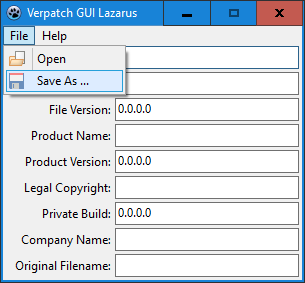

# Verpatch GUI Lazarus

A graphical user interface for [verpatch](https://www.codeproject.com/Articles/37133/Simple-Version-Resource-Tool-for-Windows), a program that allows modifying an executable's metadata (such as version info and copyright).

Made with [Lazarus](https://www.lazarus-ide.org/).

## Preview

## Usage

Requires [verpatch.exe](https://github.com/egorovsa/node-verpatch/tree/master/bin) inside this folder, or in your `PATH` environment variable.

## More

See this same program [here](https://github.com/GirkovArpa/verpatch-gui) made with [Sciter](https://sciter.com), and [here](https://github.com/GirkovArpa/verpatch-gui-win32), made with [winsafe](https://github.com/rodrigocfd/winsafe).